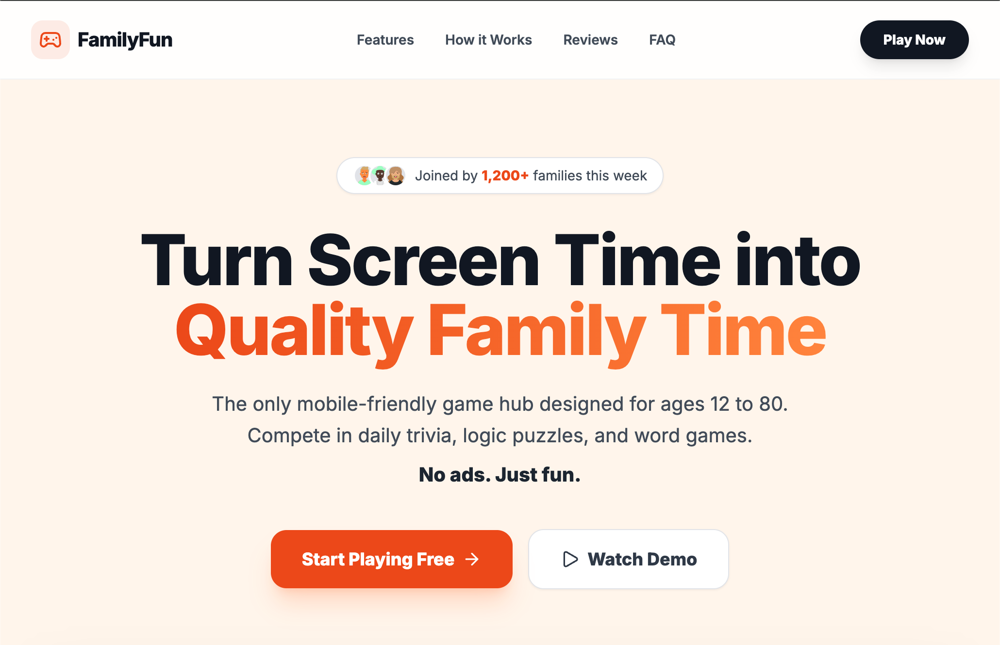
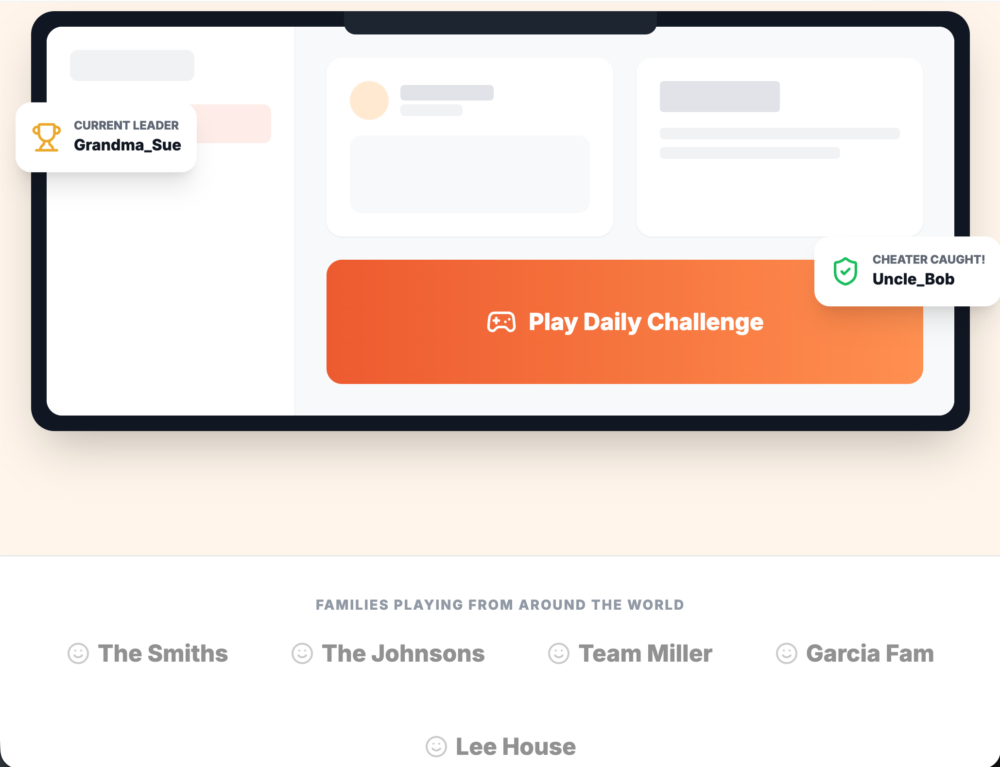
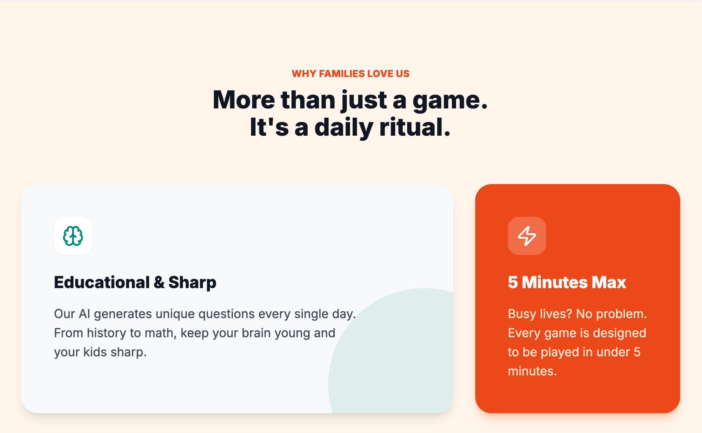
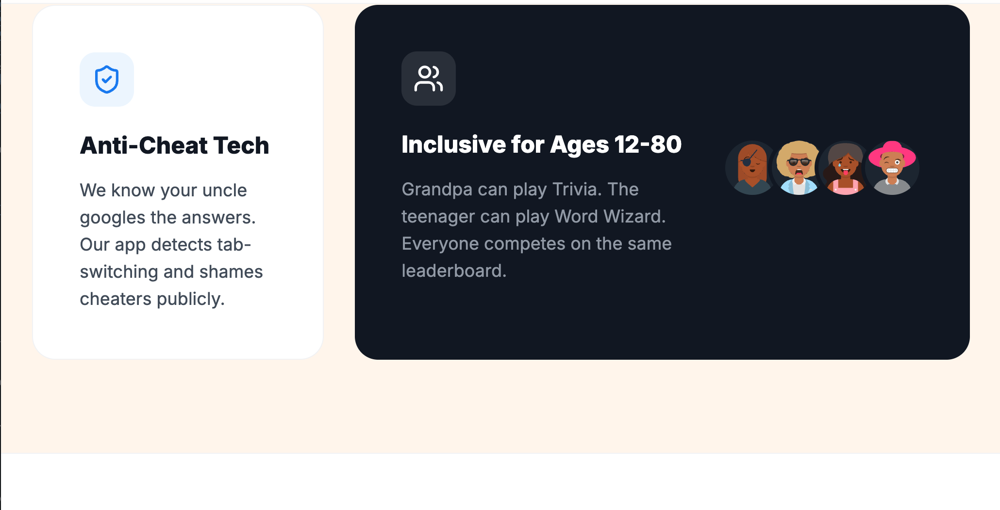
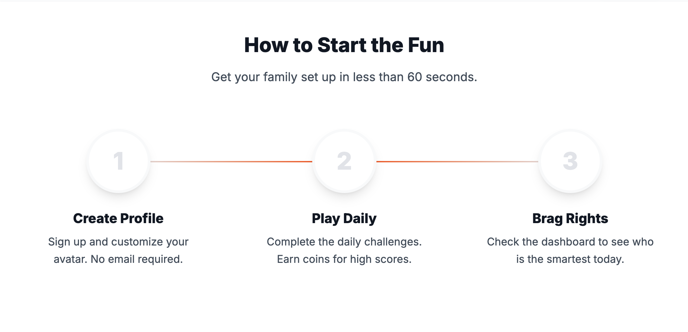
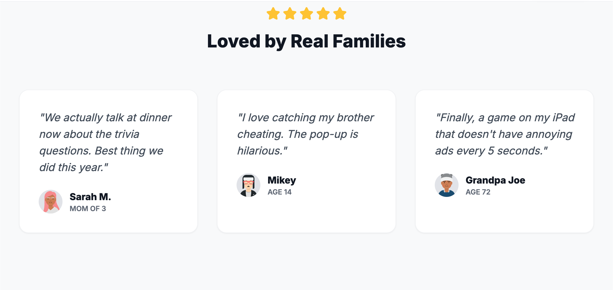
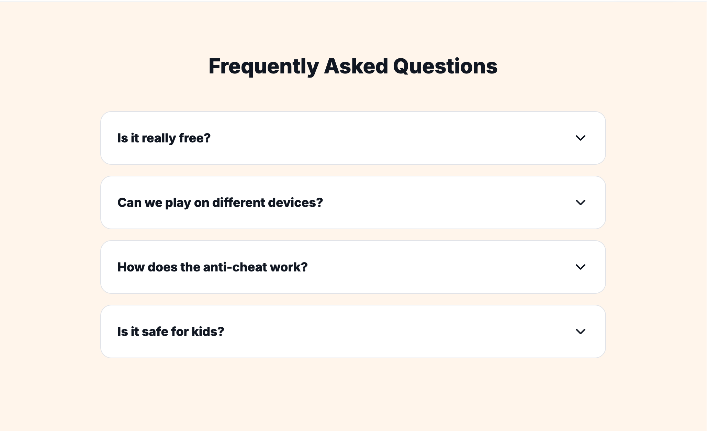

<div align="center">

# Family Fun & Brainpower

[](https://docs.docker.com/compose/)
[](https://github.com/jleboube/Family-Fun/stargazers)
[](https://github.com/jleboube/Family-Fun/network/members)
[](https://github.com/jleboube/Family-Fun/issues)
[](https://github.com/jleboube/Family-Fun/pulls)
[](https://creativecommons.org/licenses/by-nc-sa/4.0/)

[](https://www.buymeacoffee.com/muscl3n3rd)


A fun, family-friendly trivia and brain game app powered by AI. Challenge your family members to daily brain games, earn points with time-based scoring, and compete on the leaderboard!


[Demo](https://familyfun.coolshit.tech/) • [Screenshots](#screenshots) • [Features](#features) 


</div>

## Screenshots

Family Fun Trivia Landing Page
















## Features

- **5 AI-Generated Games**: Trivia, Word Wizard, Logic Lab, Emoji Enigma, and Math Mania
- **Time-Based Scoring**: Faster correct answers earn more points with speed bonuses
- **Google OAuth**: Easy sign-in with your Google account
- **Family Groups**: Create or join family groups to compete together
- **Leaderboards**: Track scores and compete with family members
- **Anti-Cheat Detection**: Fair play enforcement during games
- **Daily Challenges**: Fresh AI-generated content every day
- **Coin System**: Earn coins by performing well in games

## Tech Stack

- **Frontend**: React 18 + TypeScript + Vite
- **Styling**: Tailwind CSS
- **AI**: Google Gemini API for generating game content
- **Auth**: Google OAuth 2.0
- **Storage**: Browser localStorage (no backend required)
- **Deployment**: Docker + Nginx

## Prerequisites

- Node.js 20+
- Docker & Docker Compose (for containerized deployment)
- Google Cloud Console project with OAuth credentials
- Google Gemini API key

## Local Development

1. **Clone the repository**
   ```bash
   git clone <your-repo-url>
   cd family-fun-brainpower
   ```

2. **Install dependencies**
   ```bash
   npm install
   ```

3. **Configure environment variables**
   ```bash
   cp .env.example .env
   ```

   Edit `.env` and add your credentials:
   ```
   GEMINI_API_KEY=your_gemini_api_key_here
   GOOGLE_CLIENT_ID=your_google_oauth_client_id_here
   ```

4. **Run the development server**
   ```bash
   npm run dev
   ```

5. Open http://localhost:5173 in your browser

## Docker Deployment

1. **Configure environment variables**
   ```bash
   cp .env.example .env
   # Edit .env with your API keys
   ```

2. **Build and run with Docker Compose**
   ```bash
   docker compose up -d --build
   ```

3. Access the app at http://localhost:7943

## Google OAuth Setup

1. Go to [Google Cloud Console](https://console.cloud.google.com/)
2. Create a new project or select existing
3. Enable the Google+ API
4. Go to **Credentials** → **Create Credentials** → **OAuth 2.0 Client ID**
5. Set application type to **Web application**
6. Add authorized JavaScript origins:
   - `http://localhost:5173` (development)
   - `http://localhost:7943` (Docker)
   - Your production domain
7. Copy the Client ID to your `.env` file

## Gemini API Setup

1. Go to [Google AI Studio](https://aistudio.google.com/)
2. Click **Get API Key**
3. Create a new API key
4. Copy the key to your `.env` file

## Game Descriptions

| Game | Description | Scoring |
|------|-------------|---------|
| **Trivia Time** | AI-generated trivia questions across various topics | 2-10 pts based on speed |
| **Word Wizard** | Guess the word from its definition | 10-100 pts (speed + attempts) |
| **Logic Lab** | Brain-teasing logic puzzles | 25-50 pts based on speed |
| **Emoji Enigma** | Decode movie/phrase from emojis | 40-100 pts based on speed |
| **Math Mania** | Math problems with difficulty scaling | 1x-2x multiplier for speed |

## Project Structure

```
├── components/
│   ├── games/          # Game components
│   ├── Auth.tsx        # Authentication
│   ├── Dashboard.tsx   # User dashboard
│   ├── GameHub.tsx     # Game selection
│   ├── GameShell.tsx   # Game wrapper with timer
│   └── Navbar.tsx      # Navigation
├── services/
│   ├── geminiService.ts    # AI content generation
│   └── storageService.ts   # Local storage management
├── types.ts            # TypeScript definitions
├── App.tsx             # Main app component
├── Dockerfile          # Container build
├── docker-compose.yml  # Container orchestration
└── nginx.conf          # Production server config
```

## License

MIT
